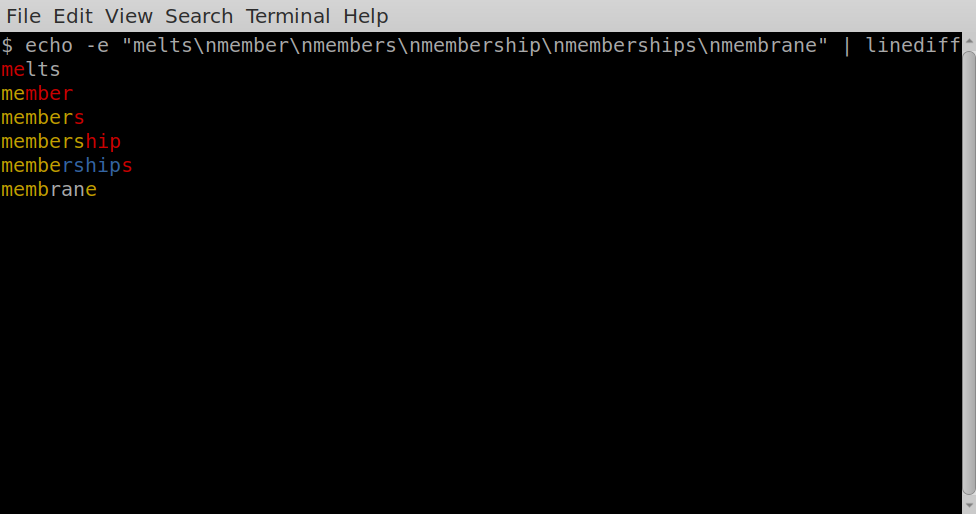

# linediff

Show how lines in a stream of text are changing.

# Requirements

Python3.

# Motivation

It can be quite difficult to see what is going on in log files.
This attempts to make this slighly easier by observing common elements of lines
as well as what is changing.

# Mechanism

Common characters between lines are colored. Yellow indicates that the characters
are present in the previous and following lines. Red indicates the character
is not present in the previous line (a new character). Blue indicates
the character is not present in the next line (the character is about to
disappear).

# Installing

```
pip install git+https://github.com/talwrii/linediff#egg=linediff
```

# Caveats

Finding common subsequence is an np-hard problem: if your file
has long lines this might be an issue.

# Examples / Cheat sheet


